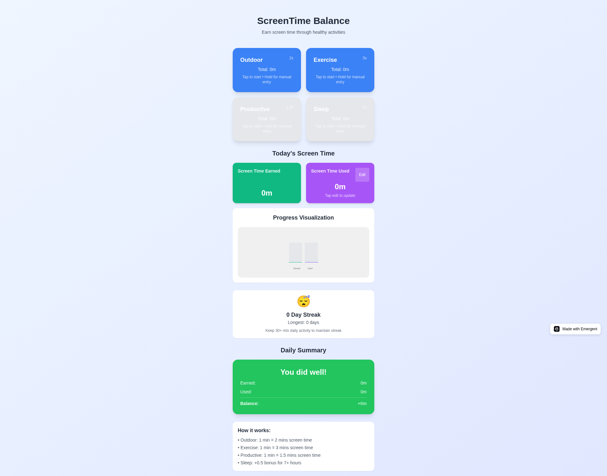
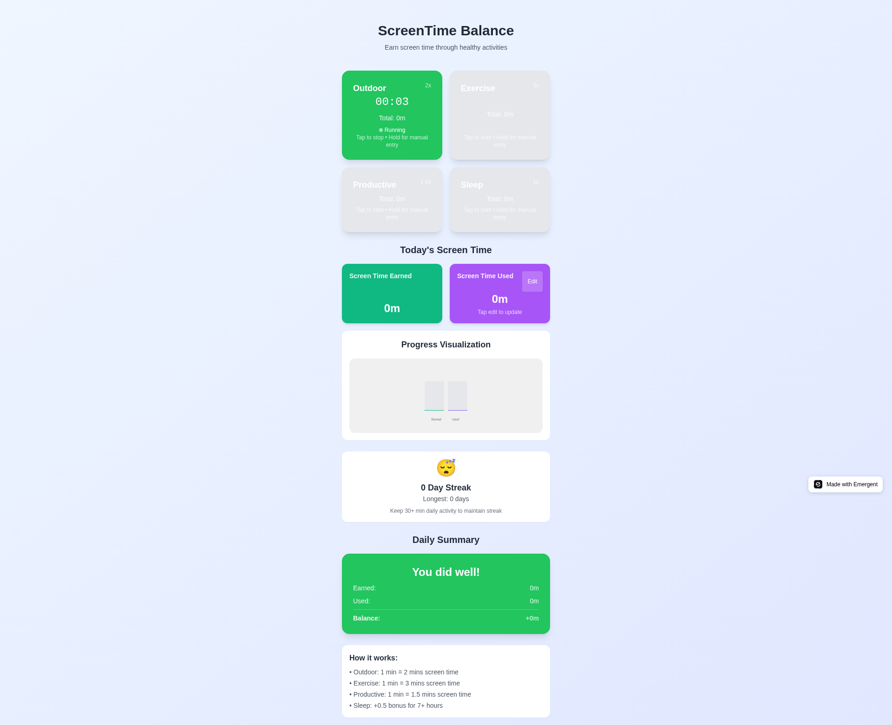
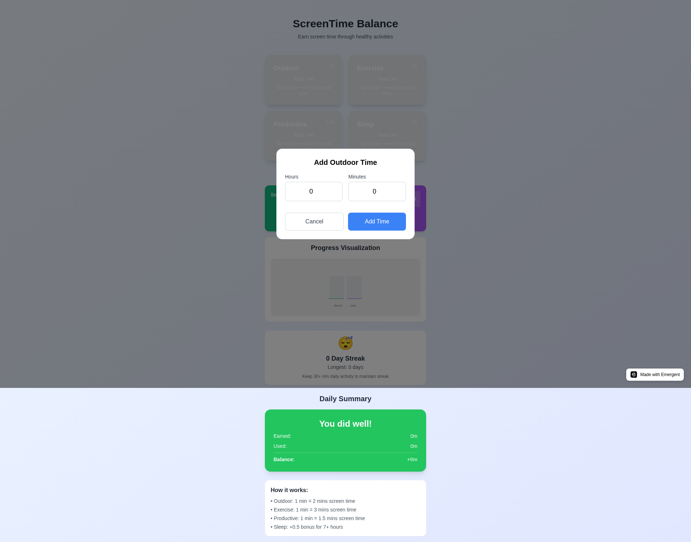
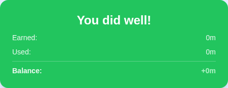
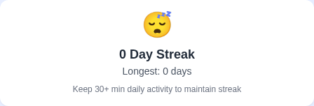
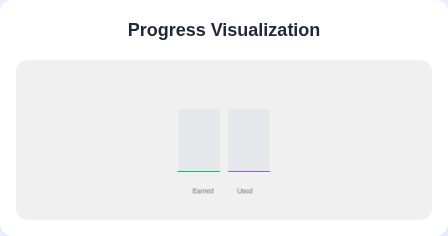
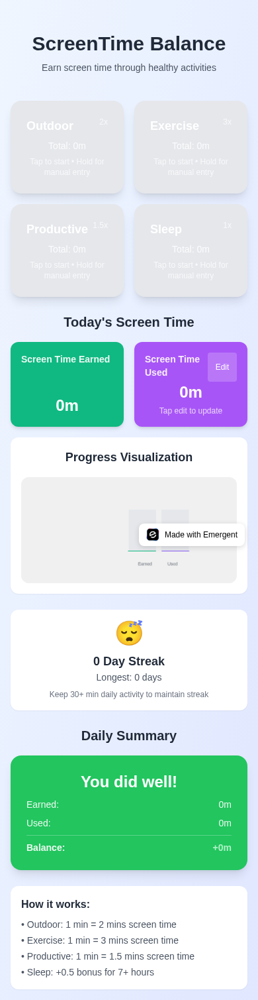

# 🎮 ScreenTime Balance PWA

**Earn screen time through healthy activities!** ScreenTime Balance is a gamified Progressive Web App that motivates users to engage in outdoor activities, exercise, productive work, and proper sleep by converting these healthy habits into earned screen time.



## 🌟 Key Features

### ⏱️ **Four Activity Timers**
- **🌳 Outdoor** (2x multiplier): 1 min outdoor = 2 mins screen time
- **💪 Exercise** (3x multiplier): 1 min exercise = 3 mins screen time  
- **📚 Productive** (1.5x multiplier): 1 min productive = 1.5 mins screen time
- **😴 Sleep** (+0.5 bonus): Extra 0.5x bonus for 7+ hours of sleep

### 📱 **One-Tap Timer Interface**
- **Single tap**: Start/stop timers instantly
- **Long press**: Open manual time entry modal
- **Real-time updates**: Live countdown and progress tracking
- **Visual feedback**: Color-coded states and running indicators



### 🎯 **Manual Time Entry**
Easy-to-use modals for adding time when you forget to start the timer:



### 📊 **Live Dashboard**
Real-time tracking of earned vs used screen time with instant calculations:



### 🔥 **Streak System**
Stay motivated with streak tracking and emoji rewards:



- 😴 No activity
- 🌱 Starting out (1-2 days)
- 🔥 Building momentum (3-6 days)
- 🚀 On fire (7-29 days)  
- 🏆 Champion (30+ days)

### 🎨 **3D Visualization**
Beautiful Three.js-powered progress visualization:



### 🎨 **Color-Coded Feedback**
- 🟢 **Green**: "You did well!" (±15 min balance)
- 🟡 **Yellow**: "Well try!" (±15-30 min balance)  
- 🔴 **Red**: "Need to improve" (>30 min over)

## 📱 Mobile-First Design

Optimized for mobile devices with touch-friendly interfaces:



## 🛠️ Tech Stack

### **Frontend**
- **React 18** with TypeScript
- **Vite** for fast development and building
- **TailwindCSS** for responsive styling
- **Redux Toolkit** for state management
- **Three.js** for 3D visualizations

### **Data & Persistence**
- **IndexedDB** with Dexie for offline-first storage
- **Service Worker** for PWA capabilities
- **Automatic data persistence** across sessions

### **PWA Features**
- 📱 Installable on mobile devices
- 🔄 Offline functionality
- ⚡ Fast loading with service worker caching
- 📲 Native app-like experience

## 🚀 Getting Started

### Prerequisites
- Node.js 16+ 
- Yarn package manager

### Installation

1. **Clone the repository**
```bash
git clone https://github.com/yourusername/screentime-balance-pwa.git
cd screentime-balance-pwa
```

2. **Install dependencies**
```bash
cd frontend
yarn install
```

3. **Start development server**
```bash
yarn dev
```

4. **Visit the app**
```
http://localhost:3000
```

### Production Build

```bash
yarn build
yarn preview
```

## 📖 How It Works

### **Activity Multipliers**
- **Outdoor activities**: Every minute outdoors earns 2 minutes of screen time
- **Exercise**: Every minute of exercise earns 3 minutes of screen time
- **Productive work**: Every minute of productive activity earns 1.5 minutes
- **Sleep bonus**: 7+ hours of sleep adds a 0.5x bonus to all earned time

### **Daily Balance**
The app calculates your daily balance using the formula:
```
Balance = Earned Screen Time - Used Screen Time
```

### **Feedback System**
- **Green zone**: Within ±15 minutes of balance
- **Yellow zone**: 15-30 minutes over your earned time
- **Red zone**: More than 30 minutes over your earned time

### **Streak Tracking**
Maintain a streak by logging at least 30 minutes of combined activity daily. The longer your streak, the better your emoji reward!

## 🏗️ Architecture

### **State Management**
```
Redux Store
├── timers/          # Timer states and data
├── screenTime/      # Earned vs used tracking  
└── persistence/     # Auto-save settings
```

### **Data Storage**
```
IndexedDB (Dexie)
├── dailyData/       # Daily activity records
└── streakData/      # Streak tracking
```

### **Component Structure**
```
src/
├── components/
│   ├── TimerBox.tsx           # Interactive timer interface
│   ├── ManualTimeModal.tsx    # Time entry modal
│   ├── ScreenTimeBox.tsx      # Earned/used display
│   ├── SummaryCard.tsx        # Daily feedback
│   ├── ThreeVisualization.tsx # 3D progress bars
│   └── StreakCounter.tsx      # Streak tracking
├── store/                     # Redux slices
├── hooks/                     # Custom React hooks
├── utils/                     # Helper functions
└── db/                        # Database layer
```

## 🎮 Usage Guide

### **Starting a Timer**
1. Tap any activity box (Outdoor, Exercise, Productive, Sleep)
2. Timer starts immediately with visual feedback
3. Tap again to stop and save the time

### **Adding Manual Time**
1. Long press (or double-click) any activity box
2. Enter hours and minutes in the modal
3. Tap "Add Time" to save

### **Tracking Screen Time**
1. Check your daily earned time in the green box
2. Manually enter your actual screen time in the purple box
3. View your balance in the summary card

### **Building Streaks**
1. Log at least 30 minutes of total activity daily
2. Check your streak counter for progress
3. Aim for consistency to unlock better emoji rewards!

## 🔧 Development

### **Available Scripts**
```bash
yarn dev          # Start development server
yarn build        # Build for production  
yarn preview      # Preview production build
yarn lint         # Run ESLint
yarn type-check   # Run TypeScript checks
```

### **Project Structure**
```
screentime-balance-pwa/
├── frontend/              # React app
│   ├── src/
│   ├── public/
│   └── package.json
├── docs/                  # Documentation and screenshots
├── tests/                # Test files
└── README.md
```

## 🧪 Testing

The app includes comprehensive testing for:
- ✅ Timer functionality (start/stop/manual entry)
- ✅ Calculation accuracy (multipliers and bonuses)
- ✅ Data persistence (IndexedDB operations)
- ✅ 3D visualization rendering
- ✅ Mobile responsiveness
- ✅ PWA capabilities

## 🚀 Deployment

### **Vercel (Recommended)**
1. Connect your GitHub repository to Vercel
2. Set build command: `cd frontend && yarn build`
3. Set output directory: `frontend/dist`
4. Deploy!

### **Netlify**
1. Connect repository to Netlify
2. Build command: `cd frontend && yarn build`
3. Publish directory: `frontend/dist`

### **Manual Deployment**
```bash
cd frontend
yarn build
# Upload dist/ folder to your hosting provider
```

## 🎯 Roadmap

### **Upcoming Features**
- [ ] **Data Export**: Export activity data to CSV
- [ ] **Goals Setting**: Set daily/weekly activity targets
- [ ] **Social Features**: Share streaks with friends
- [ ] **Advanced Analytics**: Weekly/monthly reports
- [ ] **Native Apps**: iOS and Android versions
- [ ] **Apple Health/Google Fit Integration**
- [ ] **Dark Mode Theme**
- [ ] **Custom Activity Types**

### **Enhancements**
- [ ] **Advanced Visualizations**: More 3D chart types
- [ ] **Notifications**: Reminder system
- [ ] **Achievements**: Unlock badges and rewards
- [ ] **Time Blocking**: Schedule activity sessions

## 🤝 Contributing

We welcome contributions! Please see our [Contributing Guide](CONTRIBUTING.md) for details.

### **Getting Started**
1. Fork the repository
2. Create a feature branch: `git checkout -b feature/amazing-feature`
3. Commit changes: `git commit -m 'Add amazing feature'`
4. Push to branch: `git push origin feature/amazing-feature`
5. Open a Pull Request

## 📄 License

This project is licensed under the MIT License - see the [LICENSE](LICENSE) file for details.

## 🙏 Acknowledgments

- **Three.js** for amazing 3D graphics
- **TailwindCSS** for beautiful, responsive design
- **Redux Toolkit** for efficient state management
- **Dexie** for seamless IndexedDB operations
- **React** community for excellent tooling and ecosystem

## 📞 Support

- 🐛 **Bug Reports**: [Open an issue](https://github.com/yourusername/screentime-balance-pwa/issues)
- 💡 **Feature Requests**: [Start a discussion](https://github.com/yourusername/screentime-balance-pwa/discussions)
- 📧 **Email**: your.email@example.com

---

**Start earning your screen time today!** 🎮📱✨

*Made with ❤️ for digital wellness and healthy habits*